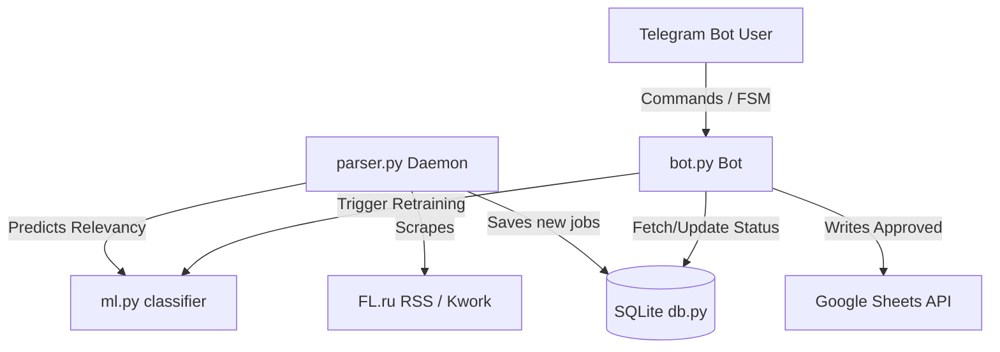

# Telegram Vacancy Tracker Bot

[](https://www.python.org/)
[](LICENSE)
[](https://github.com/psf/black)

An automated tool that tracks and parses new freelance projects and job vacancies from Kwork and FL.ru. The system uses an ML classifier (Naive Bayes) to filter out irrelevant leads, hosts a Telegram bot for manual selection/approval, and logs target opportunities to a Google Sheets document.

---

## 🚀 Key Features

* **Multi-Source Scraping**: Scrapes active freelance jobs from Kwork and FL.ru RSS feeds.
* **ML Filtering**: Automatically predicts vacancy relevance using a scikit-learn Naive Bayes model to filter out bad listings.
* **Telegram Interface**: Interact with your leads via commands and inline buttons (`/get_leads`, `Approve all`, `Replace some`).
* **Google Sheets Integration**: Automatically records approved vacancies into a designated Google Spreadsheet with fields like Title, Link, Date, and Application Status.

---

## 🛠 System Architecture



---

## 📋 Requirements

* Python 3.10+
* Telegram Bot Token (obtained via [@BotFather](https://t.me/BotFather))
* Google Cloud Platform Service Account JSON credentials (for Google Sheets/Drive integration)

---

## ⚙️ Setup and Installation

### Step 1. Clone & Prepare Environment

1. Navigate to the project directory:
   ```bash
   cd /Users/thereal_vadim/.gemini/antigravity/scratch/tg_vacancy_tracker
   ```
2. Create and activate a virtual environment:
   ```bash
   python3 -m venv venv
   source venv/bin/activate
   ```
3. Install dependencies:
   ```bash
   pip install -r requirements.txt
   ```

### Step 2. Configure Environment Variables

1. Copy the template configuration file:
   ```bash
   cp .env.example .env
   ```
2. Open `.env` and fill in the required parameters:
   * `TG_TOKEN`: Your Telegram Bot API token.
   * `SPREADSHEET_ID`: The unique ID of your Google Spreadsheet (found in its URL).
   * `ALLOWED_USERS`: Comma-separated Telegram User IDs or usernames authorized to access the bot.
   * `CREDENTIALS_FILE`: File name of your Google credentials (defaults to `credentials.json`).

### Step 3. Obtain Google Sheets Credentials (`credentials.json`)

1. Go to the [Google Cloud Console](https://console.cloud.google.com/).
2. Create a new project or select an existing one.
3. Search for and enable both the **Google Sheets API** and the **Google Drive API** in **APIs & Services > Library**.
4. In **APIs & Services > Credentials**, click **Create Credentials** and choose **Service Account**.
5. Fill out the service account information and create it.
6. Click the newly created service account in the credentials list, navigate to the **Keys** tab, click **Add Key > Create new key**, and select **JSON** format.
7. Save the downloaded JSON file as `credentials.json` in the root folder of this project.
8. **Important:** Share your Google Spreadsheet with the `client_email` listed in `credentials.json` and give it **Editor** permissions.

---

## 🏃 Running the Application

### 1. Run the Parser Daemon
The parser daemon gathers vacancies periodically (interval is configured in `config.json`):
```bash
python3 parser.py
```
To run the parser once as a dry-run and view output in the console without committing to the database:
```bash
python3 parser.py --dry-run
```

### 2. Run the Telegram Bot
Make sure your virtual environment is active and launch the bot:
```bash
python3 bot.py
```

---

## 📝 Usage

### Lead Management Workflow
1. The parser scrapes jobs, filters them using keywords/minus-words from `config.json`, and predicts probability of approval using ML.
2. In Telegram, run `/get_leads` to retrieve a list of up to 25 target vacancies.
3. Use the inline keyboard to:
   * **Approve all**: Records all presented jobs to Google Sheets as `Pending` status.
   * **Replace some**: Replaces rejected indices (e.g. `2, 5, 12-15`) with fresh leads from the DB.
4. Run `/train` to retrain the ML model on historically approved/rejected jobs once you have labeled enough samples.

### Direct Report Submission
You can send a message directly to the bot with a vacancy URL:
- The bot will parse the page title (e.g. "React Developer position").
- The second URL (if any) is treated as a screenshot link (e.g., Lightshot, imgur, or telegraph link of the sent application).
- It will write this instantly to Google Sheets as `Applied`.
